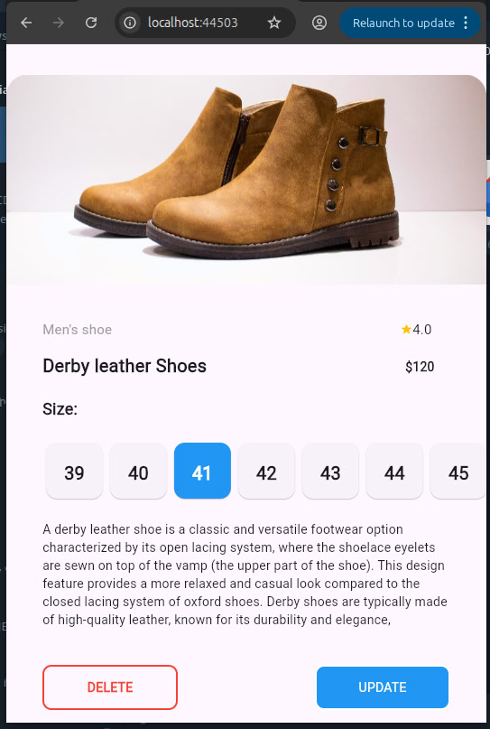
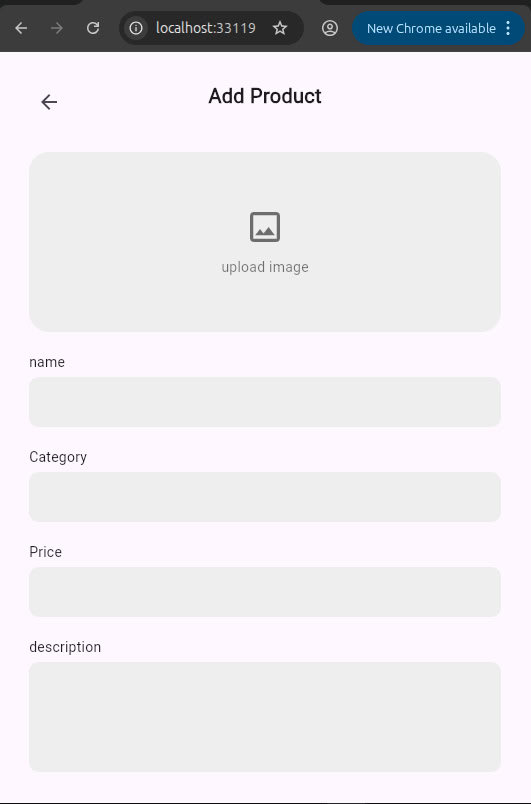
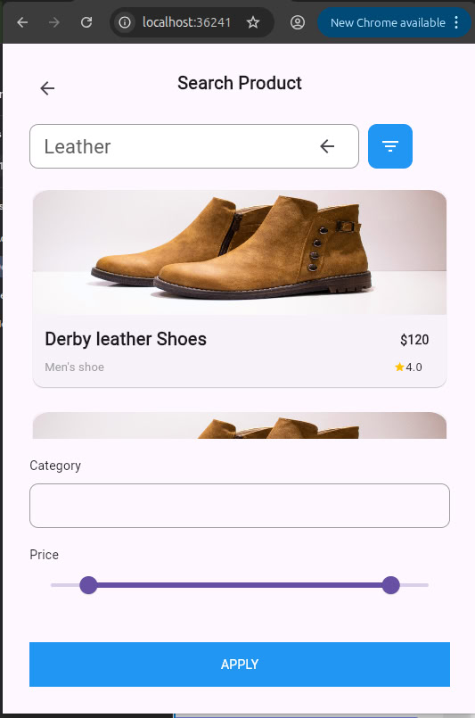

# Submission — Task 6

This project is part of the A2SV 2025 Internship Mobile Tasks. The goal was to replicate a provided Figma design using Flutter.Includes layout, colors, and typography closely matching the reference, using custom images where needed.

## How to Run
```bash
flutter pub get
flutter run
```
## Screenshots

<p align="center">
  
  
  
  
</p>