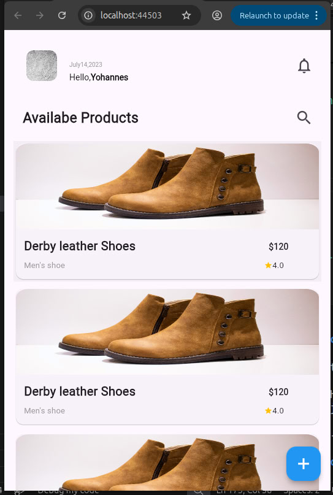

# Submission — Task 6

This project is part of the A2SV 2025 Internship Mobile Tasks. The goal was to replicate a provided Figma design using Flutter.Includes layout, colors, and typography closely matching the reference, using custom images where needed.

## How to Run
```bash
flutter pub get
flutter run
```
## Screenshots

<p align="center">
  
  
  
  
</p>

# Submission — Task 7
In this task I implemented app routing using named routes and demonstrates passing data from the Add page back to the Home page.

## Features implemented

Configured named routes in MaterialApp.
Using named routes to pass data from the add page to the home page.

# Submission — Task 9 — Domain Layer Refactoring

This task refactors the domain layer of the eCommerce app using Clean Architecture principles.

## Features implemented

Product Entity: id, name, description, imageUrl, price.

ProductRepository (abstract): defines CRUD methods (getAllProducts, getProductById, createProduct, updateProduct, deleteProduct).

Use Cases: ViewAllProductsUsecase, ViewProductUsecase, CreateProductUsecase, UpdateProductUsecase, DeleteProductUsecase.

## Key Points

Use cases call the repository interface only.

Domain layer is independent of API or DB.

Ensures clean separation of concerns and testability.

 # Submission — Task 10 — Data Overview Layer

This task implements the data layer of the eCommerce app using Clean Architecture principles, including JSON serialization and unit testing.

## Features implemented

ProductModel: mirrors the Product entity and handles JSON conversion (fromJson and toJson).

Data Layer Structure: organized inside features/product/data/ with models, repository implementations, and data sources.

Unit Tests: verify correct conversion between JSON and ProductModel, ensuring robustness against API changes.

## Key Points

Models act as adapters between API JSON and domain entities.

Domain layer remains independent of API or storage logic.

Safe type conversions handle differences in API data (e.g., int vs double, string vs int).

Ensures clean separation of concerns and testable code.

Supports modular, feature-based folder structure for maintainability and scalability.
